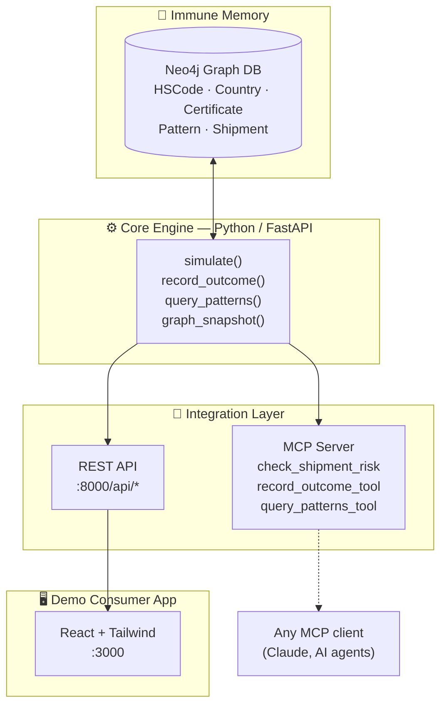

# 🛃⚡ Harbinger

### A Predictive Preemption + Immune Memory engine — stops customs holds before they happen, and gets smarter every time it's wrong.


---

## 🌍 The Problem

Demurrage and detention fees are real, per-day charges that start ticking the moment a shipment's customs paperwork has an issue — a unit count that doesn't match across documents, a missing certificate, a wrong HS code. Compliance officers juggle dozens of shipments across email and calls, and the issue usually isn't caught until the container's already sitting at port, accruing cost.

**Most tools catch this after the fact.** Harbinger doesn't.

## ⚡ What Makes This Different

Harbinger isn't a detect-and-fix bot. It's a **Predictive Preemption + Immune Memory** engine:

1. **Predict before submission** — simulates a shipment's draft documents against a compounding pattern library and returns a hold-probability score with the *specific* reason, before anything is ever filed.
2. **Immune memory, not one-shot repair** — every real outcome it's told about permanently updates a living knowledge graph, so the same failure class gets caught instantly, everywhere, forever after — not re-diagnosed from scratch each time.
3. **A pluggable engine, not a walled-garden app** — the same core logic is exposed over both a plain REST API (for any SaaS backend) and a real MCP server (for AI-agent clients like Claude), demoed here through one concrete vertical: import/export logistics.

## 🕸️ Architecture



The graph isn't just storage — it's rendered live in the web app. Confirming a real shipment outcome adds a new node/edge to the pattern library **in front of you**, which is the whole point: the memory visibly compounds.

## 🧰 Tech Stack

| Layer | Tech |
|---|---|
| Core engine | Python, FastAPI |
| Immune memory | Neo4j (graph DB) |
| REST + MCP adapters | FastAPI + `httpx`, MCP server |
| Frontend | React (Vite), Tailwind CSS + shadcn/ui, `reactflow` for live graph viz, `recharts` for the pricing page |
| Orchestration | Docker Compose |
| Voice interface | Browser Web Speech API (client-side STT/TTS) for the dashboard's voice widget; local-model text pipeline (Vignesh, V5) for the locked `/api/voice-query` contract. Speech backends are pluggable: `VOICE_PROVIDER` picks transcription *and* synthesis, `TTS_PROVIDER` moves synthesis alone elsewhere — `TTS_PROVIDER=smallest` speaks through Smallest AI Waves (Lightning), no GPU needed for that half |
| Payments | Razorpay, live test-mode integration |
| Auth | Google Sign-In (Identity Services + server-side ID token verification), with a guest-login fallback |

## 🚀 Quickstart

**Prerequisites:** Docker + Docker Compose installed.

```bash
cp .env.example .env   # fill in RAZORPAY_KEY/RAZORPAY_SECRET for live checkout — optional, degrades gracefully without them
docker-compose up --build
```

**Seed the graph** (not automatic — without this, certificate-requirement lookups return nothing and the demo shipments look artificially clean):
```bash
docker exec -it harbinger-engine python -m seed.seed_data
```

That's it — one command brings up the graph database, the core engine, the MCP adapter, and the web app together.

| Service | URL | Notes |
|---|---|---|
| 🖥️ Web App | http://localhost:3000 | The demo consumer app — a Control Tower dashboard of seeded shipments, per-shipment risk simulation, the live immune-memory graph, a voice Q&A widget, and pricing/checkout |
| ⚙️ Engine REST API | http://localhost:8000 | Interactive docs at `/docs` (Swagger) |
| 🧠 Neo4j Browser | http://localhost:7474 | Auth: `neo4j` / `password` — explore the immune memory graph directly |
| 🔌 MCP Server | http://localhost:9000/mcp | MCP endpoint (streamable-http); proxies tool calls to the engine's REST API |

**Verify it's alive:**
```bash
curl http://localhost:8000/api/patterns
```

## 📡 API Reference

| Method | Endpoint | Purpose |
|---|---|---|
| `POST` | `/api/simulate` | Given draft shipment documents, returns a hold-probability score + specific reasons |
| `POST` | `/api/record-outcome` | Records a real outcome — this is what grows the immune-memory graph |
| `GET` | `/api/graph` | Returns the current graph as nodes + edges JSON, for visualization |
| `GET` | `/api/patterns` | Lists known failure patterns, optionally filtered by HS code / country |

The web app also talks to a set of **UI-adapter endpoints** (`/api/stats`, `/api/shipments`, `/api/shipments/{id}`, `/api/approve-fix`, `/api/outcome`, `/api/pricing`, `/api/payments/*`, `/api/voice`) that exist to give the dashboard a shipment catalog — the original locked contract above never had one. They're thin translation layers over the same `simulate()`/`record_outcome()` core (see `services/engine/app/api/ui_adapter.py` and `app/core/shipment_store.py`, an in-memory demo store, not a database) and don't change anything about the locked contract's behavior.

### 🔌 MCP server

The MCP server exposes the same three operations as tools for any MCP-compatible AI agent:

| Tool | Proxies to | Arguments |
|---|---|---|
| `check_shipment_risk` | `POST /api/simulate` | `shipment_id`, `documents`, optional `hs_code`, `country` |
| `record_outcome_tool` | `POST /api/record-outcome` | `shipment_id`, `was_held`, optional `reason_code`, `detail` |
| `query_patterns_tool` | `GET /api/patterns` | optional `hs_code`, `country` |

**Networked (default in Docker Compose):** streamable-http at `http://localhost:9000/mcp`.

### 🎙️ Voice query

`POST /api/voice-query` (`{shipment_id, audio_base64}` → `{transcript, response_text, response_audio_base64}`)
transcribes the audio, answers the shipment's hold risk from the graph, and speaks it back.
The speech backend is set by `VOICE_PROVIDER`:

| `VOICE_PROVIDER` | STT / TTS | Needs |
|---|---|---|
| `text_only` *(default)* | none — `audio_base64` is treated as UTF-8 text | nothing |
| `openai` | OpenAI `/audio/transcriptions` + `/audio/speech` | `OPENAI_API_KEY` |
| `gemini` | Gemini `generateContent` | `GEMINI_API_KEY` |
| `local` | `stt` (faster-whisper, or Kroko/sherpa-onnx via `STT_ENGINE=sherpa`) + `tts` (Kokoro-82M) containers | — |

Synthesis can be pointed at a different backend than transcription, because the best
STT and the best TTS are rarely the same service. `TTS_PROVIDER` overrides the speaking
half only; leave it unset and nothing changes.

| `TTS_PROVIDER` | TTS | Needs |
|---|---|---|
| *(unset, default)* | whatever `VOICE_PROVIDER` says | — |
| `smallest` | Smallest AI Waves (Lightning v3.1) — no GPU, no local `tts` container | `SMALLEST_AI_KEY` |
| `openai` / `gemini` / `vertex` / `local` | as above | that provider's credentials |

`smallest` is available on this axis only: Waves is text-to-speech, it has no
transcription endpoint. The intended pairing on a GPU box is
`VOICE_PROVIDER=local` (faster-whisper transcribes on CUDA) +
`TTS_PROVIDER=smallest` (Waves speaks). If the override can't be built — no key —
synthesis falls back to `VOICE_PROVIDER`'s own TTS rather than going silent.
Voice ids are not free-form; list them with
`curl -H "Authorization: Bearer $SMALLEST_AI_KEY" https://api.smallest.ai/waves/v1/lightning-v3.1/get_voices`.

The risk answer is always computed locally from the graph; only speech I/O varies.
`stt` (`:8100`) and `tts` (`:8200`) are **opt-in** — a plain `docker-compose up` never
starts them (and doesn't need to: the dashboard's own voice widget uses the browser's
Web Speech API, and the locked contract defaults to `text_only`). Bring them up
explicitly with:

```bash
docker compose --profile voice-local up --build
```

Both default to CPU (`STT_DEVICE=auto`, `KOKORO_DEVICE=auto` — CPU when no GPU is
visible). On a real GPU host with `nvidia-container-toolkit`, uncomment the `deploy`
block for each service in `docker-compose.yml` and, for `tts`, set
`TORCH_INDEX_URL=https://download.pytorch.org/whl/cu126`. On Apple Silicon, run `tts`
natively instead with `TTS_BACKEND=mlx` (not a container target).

**Local stdio (e.g. Claude Desktop / Claude Code):** run it directly and point the engine at your local instance —

```bash
cd services/mcp-server
pip install -r requirements.txt
ENGINE_URL=http://localhost:8000 MCP_TRANSPORT=stdio python server.py
```

Transport is chosen with `MCP_TRANSPORT` (`stdio` | `streamable-http` | `sse`); `MCP_HOST` / `MCP_PORT` configure the networked modes.

## 🗂️ Project Structure

```
.
├── docker-compose.yml
├── services/
│   ├── engine/        # Core FastAPI engine + Neo4j graph logic
│   └── mcp-server/     # MCP adapter, proxies to the engine over HTTP
├── apps/
│   └── web/            # React (Vite) + Tailwind demo app — Control Tower
│                       # dashboard, ported from an Emergent-generated build
└── TASKS.md            # Team workstreams — see below
```

## 📋 Team Task Board

Workstreams, owners, and checklists live in **[TASKS.md](./TASKS.md)** — claim one and check items off as you go.

## 🏆 Built for The Hive Hackathon

Built at **The Hive Hackathon by ApplyBee AI**, competing on the **Revenue** track — sold to freight forwarders and exporters as a per-shipment protection fee, priced against the exact demurrage cost it prevents.
