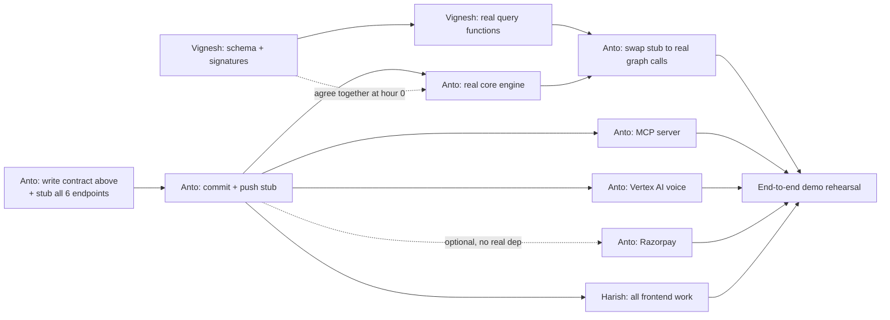

# TASKS.md

Team: 3 devs — Anto (Lead + Backend), Vignesh (Backend), Harish (Frontend).
**Each of you is likely working with your own coding agent** (Claude Code,
Antigravity, etc.) — those agents won't share context with each other, so
every dependency between your tasks is written explicitly below. Don't
assume your agent knows what another person's agent has done; check the
dependency tag before starting a task.

Docker Compose brings up all services together — run `docker-compose up`
from the repo root to start.

---

## 📜 Shared API Contract — the single source of truth

This is the exact shape every endpoint returns. **Anto commits this as a
working stub (hardcoded fake data matching these shapes) before anyone else
starts.** Nobody should need to guess a field name — if a shape needs to
change after work has started, whoever changes it must say so directly to
the other two, not just push it silently.

### `POST /api/simulate`
```json
// Request
{ "shipment_id": "MSKU1234567", "documents": {
    "commercial_invoice": { "units": 500, "hs_code": "8471.30" },
    "packing_list": { "units": 480 },
    "bill_of_lading": {},
    "certificate_of_origin": null
} }
// Response
{ "shipment_id": "MSKU1234567", "risk_score": 0.73, "reasons": [
    { "code": "UNIT_MISMATCH", "detail": "Invoice lists 500 units, Packing List lists 480" },
    { "code": "MISSING_CERTIFICATE", "detail": "HS code 8471.30 into this destination requires a Certificate of Origin" }
  ], "matched_patterns": ["PAT-001", "PAT-014"] }
```

### `POST /api/record-outcome`
```json
// Request
{ "shipment_id": "MSKU1234567", "actual_outcome": { "was_held": true, "reason_code": "MISSING_CERTIFICATE" } }
// Response
{ "status": "recorded", "pattern_updated": true, "new_nodes": ["PAT-015"], "new_edges": [{"from": "PAT-015", "to": "MISSING_CERTIFICATE", "type": "CAUSED_REJECTION"}] }
```

### `GET /api/graph`
```json
// Response
{ "nodes": [ { "id": "PAT-001", "type": "Pattern", "label": "Unit mismatch" }, { "id": "HS-8471.30", "type": "HSCode", "label": "8471.30" } ],
  "edges": [ { "from": "HS-8471.30", "to": "CERT-EU-ORIGIN", "type": "REQUIRES" } ] }
```

### `GET /api/patterns?hs_code=&country=`
```json
{ "patterns": [ { "pattern_id": "PAT-001", "type": "unit_mismatch", "frequency": 14, "confidence": 0.91 } ] }
```

### `POST /api/voice-query`  *(needed for Harish's VoiceWidget — not in the original plan, added now)*
```json
// Request
{ "shipment_id": "MSKU1234567", "audio_base64": "<recorded audio>" }
// Response
{ "transcript": "What's this shipment's hold risk?", "response_text": "73% likely held: missing Certificate of Origin.", "response_audio_base64": "<synthesized speech>" }
```

### `POST /api/create-payment-order` and `POST /api/verify-payment`  *(needed for Harish's PricingCheckout — not in the original plan, added now)*
```json
// create-payment-order request/response
{ "plan_type": "per_shipment" } -> { "order_id": "order_abc123", "amount": 3500, "currency": "INR", "razorpay_key_id": "rzp_test_xxx" }
// verify-payment request/response
{ "order_id": "order_abc123", "payment_id": "pay_xyz", "signature": "..." } -> { "status": "success" }
```

---

## 🔗 Dependency graph



**Read this as:** almost everything only depends on the **stub existing**
(A3), not on any real logic being finished. Only A5 (swapping fake graph
calls for real ones) needs Vignesh's actual work (V4). That's the one true
hard dependency between people — everything else is parallel.

---

## Anto — Lead + Backend

**🔓 No dependency — start immediately:**
- [ ] **A1.** Write the API contract above into `services/engine/app/api/schemas.py`
      as Pydantic models (request/response for all 6 endpoints)
- [ ] **A2.** Implement all 6 REST routes in `services/engine/app/api/routes.py`
      returning **hardcoded data matching the contract exactly** — no real
      logic, just return the example JSON above (or close variants)
- [ ] **A3. 🚨 COMMIT + PUSH NOW.** This is the commit Harish and (partly)
      Vignesh are waiting on. Do not batch this with other work — push it
      the moment the stub routes return valid JSON, even before anything
      else is done.

**🔒 Depends on: verbal agreement with Vignesh on function signatures (5–10 min conversation, not a commit)**
- [ ] **A4.** Implement real core engine in `services/engine/app/core/engine.py`:
      `simulate()`, `record_outcome()`, `query_patterns()`, `graph_snapshot()`
      — call Vignesh's `neo4j_client.py` functions using whatever signature
      you two agreed on. You can build this against a **local fake** of
      Vignesh's functions (returning hardcoded graph data) if V4 isn't
      ready yet — don't block on Vignesh finishing.

**🔒 Depends on: A3 (stub live)**
- [ ] **A6.** Build the MCP server in `services/mcp-server/server.py`:
      3 tools (`check_shipment_risk`, `record_outcome_tool`,
      `query_patterns_tool`), each calling the REST endpoints via `httpx`.
      This only needs A3, not A4/A5 — build it right after the stub, don't
      wait for real logic.
- [ ] **A7.** Vertex AI voice pipeline: implement `/api/voice-query` for
      real (STT the incoming audio, call `simulate()` or `query_patterns()`
      internally, TTS the response). Can be built and tested against the
      A2 stub before A4/A5 are real.
- [ ] **A8.** Razorpay integration: implement `/api/create-payment-order`
      and `/api/verify-payment` for real. Zero dependency on the engine
      logic at all — do this whenever, even first, if you want a quick win
      before tackling A4.

**🔒 Depends on: A4 done + V4 done (Vignesh's real graph functions)**
- [ ] **A5.** Swap the stub graph calls inside `simulate()`/`record_outcome()`
      for real calls into Vignesh's `neo4j_client.py`. Coordinate this
      hand-off directly with Vignesh — don't just merge and hope the
      signatures still match.

**Lead/coordination (ongoing, not blocked on anything):**
- [ ] Unblock Vignesh and Harish when they hit an interface question
- [ ] Own the A5 integration merge and any contract changes — if you must
      change a response shape after Harish has started, tell him immediately
- [ ] Own final submission: repo cleanliness, README/build instructions, demo video/live URL
- [ ] Own demo rehearsal — run the full 90–105 sec script end-to-end multiple times

---

## Vignesh — Backend: Immune Memory Graph

**🔓 No dependency — start immediately:**
- [ ] **V1.** Agree with Anto (verbally, ~10 min) on the exact function
      signatures he'll call, e.g.:
      `find_matching_patterns(hs_code: str, country: str, documents: dict) -> list[Pattern]`
      `record_pattern(rejection_reason: str, shipment_context: dict) -> Pattern`
      Write these down in `services/engine/app/graph/neo4j_client.py` as
      function stubs (empty bodies, correct signatures) so Anto can import
      against them even before they're implemented.
- [ ] **V2.** Design the Neo4j schema: nodes (`HSCode {code, description}`,
      `Country {name, code}`, `CertificateRequirement {name, issuing_body}`,
      `DocumentType {name}`, `RejectionReason {reason_code, description}`,
      `Shipment {shipment_id, status}`, `Pattern {pattern_id, type, frequency, confidence}`)
      and edges (`REQUIRES`, `CONTRADICTS`, `CAUSED_REJECTION`, `MATCHES`, `RESOLVED_BY`)
- [ ] **V3.** Write `services/engine/app/seed/seed_data.py`: load the schema
      above with 3 contradiction types (unit mismatch, HS code mismatch,
      missing certificate) across a handful of shipments

**🔓 No external dependency, but blocks Anto's A5:**
- [ ] **V4.** Implement the real Cypher queries in `neo4j_client.py` behind
      the signatures from V1. **When done, tell Anto directly** — this is
      what unblocks his A5. Don't just push and assume he'll notice.

---

## Harish — Frontend: React + Tailwind

**🔒 Depends on: A3 only (the stub, not any real logic) — everything below can be built the moment A3 is pushed:**
- [ ] **H1.** ShipmentUpload: upload 4 document types, `POST /api/simulate`
- [ ] **H2.** RiskChecklist: render `risk_score` + `reasons[]` from the
      contract above, plus a drafted-fix approval flow
- [ ] **H3.** GraphVisualization: render `nodes[]`/`edges[]` from
      `GET /api/graph` (use `vis-network`), and make sure it visibly
      re-renders after a `record-outcome` call — this live "memory
      growing" moment is a core part of the demo
- [ ] **H4.** VoiceWidget: mic button, calls `POST /api/voice-query`, plays
      back `response_audio_base64`, shows `transcript` + `response_text`
- [ ] **H5.** PricingCheckout: pricing screen with ROI math, calls
      `POST /api/create-payment-order` then `POST /api/verify-payment`
      on the Razorpay checkout callback

**Nothing here depends on A4, A5, A6, A7, or A8 being real** — the contract
is the only thing that matters to you. If something you need isn't in the
contract above, add it there yourself and flag it to Anto rather than
guessing a shape.
