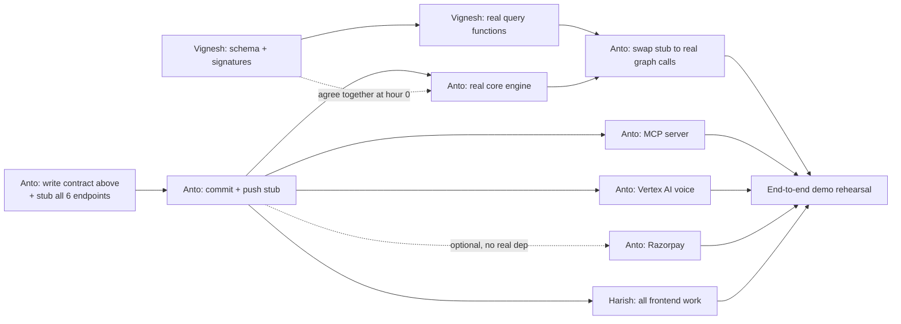

# TASKS.md

Team: 3 devs — Anto (Lead + Backend), Vignesh (Backend), Harish (Frontend).
**Each of you is likely working with your own coding agent** (Claude Code,
Antigravity, etc.) — those agents won't share context with each other, so
every dependency between your tasks is written explicitly below. Don't
assume your agent knows what another person's agent has done; check the
dependency tag before starting a task.

Docker Compose brings up all services together — run `docker-compose up`
from the repo root to start.

---

## 📜 Shared API Contract — the single source of truth

This is the exact shape every endpoint returns. **Anto commits this as a
working stub (hardcoded fake data matching these shapes) before anyone else
starts.** Nobody should need to guess a field name — if a shape needs to
change after work has started, whoever changes it must say so directly to
the other two, not just push it silently.

### `POST /api/simulate`
```json
// Request
{ "shipment_id": "MSKU1234567", "documents": {
    "commercial_invoice": { "units": 500, "hs_code": "8471.30" },
    "packing_list": { "units": 480 },
    "bill_of_lading": {},
    "certificate_of_origin": null
} }
// Response
{ "shipment_id": "MSKU1234567", "risk_score": 0.73, "reasons": [
    { "code": "UNIT_MISMATCH", "detail": "Invoice lists 500 units, Packing List lists 480" },
    { "code": "MISSING_CERTIFICATE", "detail": "HS code 8471.30 into this destination requires a Certificate of Origin" }
  ], "matched_patterns": ["PAT-001", "PAT-014"] }
```

### `POST /api/record-outcome`
```json
// Request
{ "shipment_id": "MSKU1234567", "actual_outcome": { "was_held": true, "reason_code": "MISSING_CERTIFICATE" } }
// Response
{ "status": "recorded", "pattern_updated": true, "new_nodes": ["PAT-015"], "new_edges": [{"from": "PAT-015", "to": "MISSING_CERTIFICATE", "type": "CAUSED_REJECTION"}] }
```

### `GET /api/graph`
```json
// Response
{ "nodes": [ { "id": "PAT-001", "type": "Pattern", "label": "Unit mismatch" }, { "id": "HS-8471.30", "type": "HSCode", "label": "8471.30" } ],
  "edges": [ { "from": "HS-8471.30", "to": "CERT-EU-ORIGIN", "type": "REQUIRES" } ] }
```

### `GET /api/patterns?hs_code=&country=`
```json
{ "patterns": [ { "pattern_id": "PAT-001", "type": "unit_mismatch", "frequency": 14, "confidence": 0.91 } ] }
```

### `POST /api/voice-query`  *(needed for Harish's VoiceWidget — not in the original plan, added now)*
```json
// Request
{ "shipment_id": "MSKU1234567", "audio_base64": "<recorded audio>" }
// Response
{ "transcript": "What's this shipment's hold risk?", "response_text": "73% likely held: missing Certificate of Origin.", "response_audio_base64": "<synthesized speech>" }
```

### `POST /api/create-payment-order` and `POST /api/verify-payment`  *(needed for Harish's PricingCheckout — not in the original plan, added now)*
```json
// create-payment-order request/response
{ "plan_type": "per_shipment" } -> { "order_id": "order_abc123", "amount": 3500, "currency": "INR", "razorpay_key_id": "rzp_test_xxx" }
// verify-payment request/response
{ "order_id": "order_abc123", "payment_id": "pay_xyz", "signature": "..." } -> { "status": "success" }
```

---

## 🔗 Dependency graph



**Read this as:** almost everything only depends on the **stub existing**
(A3), not on any real logic being finished. Only A5 (swapping fake graph
calls for real ones) needs Vignesh's actual work (V4). That's the one true
hard dependency between people — everything else is parallel.

---

## Anto — Lead + Backend

**🔓 No dependency — start immediately:**
- [x] ~~**A1.** Write the API contract above into `services/engine/app/api/schemas.py`
      as Pydantic models (request/response for all 6 endpoints)~~
      *(done inline as Pydantic models in `routes.py` instead of a separate
      `schemas.py` — functionally equivalent, all 6 endpoints covered)*
- [x] ~~**A2.** Implement all 6 REST routes in `services/engine/app/api/routes.py`
      returning **hardcoded data matching the contract exactly** — no real
      logic, just return the example JSON above (or close variants)~~
      *(all 7 endpoints — the original 4 plus voice-query/create-payment-order/
      verify-payment — verified live against a running instance, response
      shapes corrected to match the contract exactly)*
- [x] ~~**A3. 🚨 COMMIT + PUSH NOW.** This is the commit Harish and (partly)
      Vignesh are waiting on. Do not batch this with other work — push it
      the moment the stub routes return valid JSON, even before anything
      else is done.~~
      *(pushed — commit `dfc1587`. Bonus fix: `main.py` imported
      `graph/neo4j_client.py`, which didn't exist yet and would have
      crashed the app on boot. Added a no-op placeholder so the stub runs
      without Neo4j — Vignesh replaces its internals for real in V2/V4.)*

**🔓 No dependency — signatures are finalized, no conversation needed:**
- [x] ~~**A4.** Implement real core engine in `services/engine/app/core/engine.py`:
      `simulate()`, `record_outcome()`, `query_patterns()`, `graph_snapshot()`.~~
      *(done and verified against 5 real payloads — unit mismatch, HS code
      mismatch, and clean-shipment cases all detect correctly with no
      false positives; record-outcome/patterns/graph correctly return
      sparse/empty results since they depend on Vignesh's still-stubbed
      graph_client methods, not a bug. Ready for A5 the moment V4 lands.)*

**🔒 Depends on: A3 (stub live)**
- [x] ~~**A6.** Build the MCP server in `services/mcp-server/server.py`:
      3 tools (`check_shipment_risk`, `record_outcome_tool`,
      `query_patterns_tool`), each calling the REST endpoints via `httpx`.~~
      *(reassigned to Vignesh once V1–V4 landed, to parallelize backend work.
      Done on branch `vignesh/a6-mcp-server`: real `FastMCP` server, 3 tools
      proxying the REST API, `MCP_TRANSPORT` env picks `stdio` /
      `streamable-http` / `sse`, 10 unit tests. Verified end-to-end with a
      real MCP client through the server to the engine to a seeded Neo4j —
      `record_outcome_tool` reinforced PAT-001 14→15. Also bumps the
      `mcp-server` service in `docker-compose.yml` to publish :9000 and run
      streamable-http. Anto to review/merge the branch.)*
- [ ] **A7.** Vertex AI voice pipeline: implement `/api/voice-query` for
      real (STT the incoming audio, call `simulate()` or `query_patterns()`
      internally, TTS the response). Can be built and tested against the
      A2 stub before A4/A5 are real.
- [ ] **A8.** Razorpay integration: implement `/api/create-payment-order`
      and `/api/verify-payment` for real. Zero dependency on the engine
      logic at all — do this whenever, even first, if you want a quick win
      before tackling A4.

**🔒 Depends on: A4 done + V4 done (Vignesh's real graph functions)**
- [x] ~~**A5.** Swap the stub graph calls inside `simulate()`/`record_outcome()`
      for real calls into Vignesh's `neo4j_client.py`.~~
      *(done. The signatures did NOT match on first merge — Vignesh's real
      implementation predates A4 and diverged from the placeholder interface
      it was built against: `get_required_certificates()` doesn't exist
      (folded into `find_matching_patterns()` internally), `find_matching_patterns()`
      takes raw `documents` not a pre-computed signal, `record_pattern()`
      takes different keyword args, `graph_snapshot()` was named
      `get_graph_snapshot()` on our side, and everything returns
      `Pattern`/`GraphSnapshot` dataclasses, not dicts. Rewrote `engine.py`
      to call the real interface correctly and DELETED the duplicate
      contradiction-detection logic A4 had written locally — Vignesh's
      `graph.rules` module is now the single source of truth for that,
      applied internally by `find_matching_patterns()`. Also found and fixed:
      `SimulateRequest` in `routes.py` never declared a `country` field, so
      Pydantic silently dropped it before it reached the engine — added it.
      Verified against a real, seeded Neo4j instance (throwaway Docker
      container): `/simulate` correctly matched real stored patterns
      (PAT-001, PAT-014), and `/record-outcome` genuinely incremented
      PAT-001's frequency 14→15 and confidence 0.82→0.83 — the "immune
      memory grows" mechanic works end-to-end, not just in theory.)*

**Lead/coordination (ongoing, not blocked on anything):**
- [ ] Unblock Vignesh and Harish when they hit an interface question
- [ ] Own the A5 integration merge and any contract changes — if you must
      change a response shape after Harish has started, tell him immediately
- [ ] Own final submission: repo cleanliness, README/build instructions, demo video/live URL
- [ ] Own demo rehearsal — run the full 90–105 sec script end-to-end multiple times

---

## Vignesh — Backend: Immune Memory Graph

**🔓 No dependency — start immediately:**
- [x] ~~**V1.** Agree with Anto (verbally, ~10 min) on the exact function
      signatures he'll call~~ *(done without a live conversation — the
      finalized interface is written directly into
      `services/engine/app/graph/neo4j_client.py`:
      `get_required_certificates()`, `find_matching_patterns()`,
      `record_pattern()`, `list_patterns()`, `get_graph_snapshot()`, each
      with full docstrings and expected return shapes. Implement the
      bodies of these exact methods — don't rename or change signatures
      without telling Anto, since A4 is being built against them as-is.)*
- [x] ~~**V2.** Design the Neo4j schema~~ *(done — 7 node labels, 7 uniqueness
      constraints, canonical edges plus 2 additive structural edges
      (`DECLARES_HS`, `DESTINED_FOR`) needed to filter patterns by HS/country
      — approved, purely additive, in `graph/schema.py`)*
- [x] ~~**V3.** Write `services/engine/app/seed/seed_data.py`~~ *(done — 3
      contradiction types across 4 shipments, patterns PAT-001/002/014,
      idempotent)*

**🔓 No external dependency, but blocks Anto's A5:**
- [x] ~~**V4.** Implement the real Cypher queries~~ *(done — but note for
      next time: this was built against the placeholder interface from
      before A4 existed, and diverged from what A4 actually called
      (different method names/args, dataclasses vs dicts). Reconciled on
      Anto's side in A5 — no changes needed on this file going forward
      unless the interface itself changes again. Verified against a real
      seeded Neo4j instance: pattern matching and frequency-reinforcement
      both work correctly end-to-end.)*

---

## Harish — Frontend: React + Tailwind

**🔒 Depends on: A3 only (the stub, not any real logic) — everything below can be built the moment A3 is pushed:**
- [ ] **H1.** ShipmentUpload: upload 4 document types, `POST /api/simulate`
- [ ] **H2.** RiskChecklist: render `risk_score` + `reasons[]` from the
      contract above, plus a drafted-fix approval flow
- [ ] **H3.** GraphVisualization: render `nodes[]`/`edges[]` from
      `GET /api/graph` (use `vis-network`), and make sure it visibly
      re-renders after a `record-outcome` call — this live "memory
      growing" moment is a core part of the demo
- [ ] **H4.** VoiceWidget: mic button, calls `POST /api/voice-query`, plays
      back `response_audio_base64`, shows `transcript` + `response_text`
- [ ] **H5.** PricingCheckout: pricing screen with ROI math, calls
      `POST /api/create-payment-order` then `POST /api/verify-payment`
      on the Razorpay checkout callback

**Nothing here depends on A4, A5, A6, A7, or A8 being real** — the contract
is the only thing that matters to you. If something you need isn't in the
contract above, add it there yourself and flag it to Anto rather than
guessing a shape.
