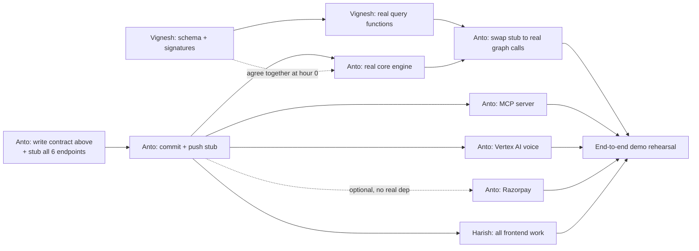

# TASKS.md

Team: 3 devs — Anto (Lead + Backend), Vignesh (Backend), Harish (Frontend).
**Each of you is likely working with your own coding agent** (Claude Code,
Antigravity, etc.) — those agents won't share context with each other, so
every dependency between your tasks is written explicitly below. Don't
assume your agent knows what another person's agent has done; check the
dependency tag before starting a task.

Docker Compose brings up all services together — run `docker-compose up`
from the repo root to start.

---

## 📜 Shared API Contract — the single source of truth

This is the exact shape every endpoint returns. **Anto commits this as a
working stub (hardcoded fake data matching these shapes) before anyone else
starts.** Nobody should need to guess a field name — if a shape needs to
change after work has started, whoever changes it must say so directly to
the other two, not just push it silently.

### `POST /api/simulate`
```json
// Request
{ "shipment_id": "MSKU1234567", "documents": {
    "commercial_invoice": { "units": 500, "hs_code": "8471.30" },
    "packing_list": { "units": 480 },
    "bill_of_lading": {},
    "certificate_of_origin": null
} }
// Response
{ "shipment_id": "MSKU1234567", "risk_score": 0.73, "reasons": [
    { "code": "UNIT_MISMATCH", "detail": "Invoice lists 500 units, Packing List lists 480" },
    { "code": "MISSING_CERTIFICATE", "detail": "HS code 8471.30 into this destination requires a Certificate of Origin" }
  ], "matched_patterns": ["PAT-001", "PAT-014"] }
```

### `POST /api/record-outcome`
```json
// Request
{ "shipment_id": "MSKU1234567", "actual_outcome": { "was_held": true, "reason_code": "MISSING_CERTIFICATE" } }
// Response
{ "status": "recorded", "pattern_updated": true, "new_nodes": ["PAT-015"], "new_edges": [{"from": "PAT-015", "to": "MISSING_CERTIFICATE", "type": "CAUSED_REJECTION"}] }
```

### `GET /api/graph`
```json
// Response
{ "nodes": [ { "id": "PAT-001", "type": "Pattern", "label": "Unit mismatch" }, { "id": "HS-8471.30", "type": "HSCode", "label": "8471.30" } ],
  "edges": [ { "from": "HS-8471.30", "to": "CERT-EU-ORIGIN", "type": "REQUIRES" } ] }
```

### `GET /api/patterns?hs_code=&country=`
```json
{ "patterns": [ { "pattern_id": "PAT-001", "type": "unit_mismatch", "frequency": 14, "confidence": 0.91 } ] }
```

### `POST /api/simulate-from-documents`  *(added later — extracts fields from real uploaded documents instead of requiring pre-typed JSON; MCP tool `check_shipment_risk_from_documents` wraps this)*
```json
// Request — each document is base64-encoded file content (PDF/PNG/JPEG); certificate_of_origin is omitted entirely if none exists
{ "shipment_id": "MSKU1234567", "country": "DE",
  "commercial_invoice": {"filename": "invoice.pdf", "content_base64": "..."},
  "packing_list": {"filename": "packing.pdf", "content_base64": "..."},
  "bill_of_lading": {"filename": "bol.pdf", "content_base64": "..."} }
// Response — identical shape to /simulate, plus what was actually read off each file
{ "shipment_id": "MSKU1234567", "risk_score": 0.62, "reasons": [...], "matched_patterns": ["PAT-014"],
  "extracted_documents": { "commercial_invoice": {"units": 250, "hs_code": "8471.30"},
    "packing_list": {"units": 250}, "bill_of_lading": {"hs_code": "8471.30"},
    "certificate_of_origin": null } }
```
The bill of lading's `hs_code` is treated as the shipment's *declared* HS code (checked
against the invoice's own `hs_code` for a mismatch, same as `detect_hs_code_mismatch`
already does) — see `services/engine/app/documents/extraction.py` for exactly which
fields get extracted from which document and why (it's only 4 values total, not full
document understanding).

### `POST /api/voice-query`  *(needed for Harish's VoiceWidget — not in the original plan, added now)*
```json
// Request
{ "shipment_id": "MSKU1234567", "audio_base64": "<recorded audio>" }
// Response
{ "transcript": "What's this shipment's hold risk?", "response_text": "73% likely held: missing Certificate of Origin.", "response_audio_base64": "<synthesized speech>" }
```

### `POST /api/create-payment-order` and `POST /api/verify-payment`  *(needed for Harish's PricingCheckout — not in the original plan, added now)*
```json
// create-payment-order request/response
{ "plan_type": "per_shipment" } -> { "order_id": "order_abc123", "amount": 3500, "currency": "INR", "razorpay_key_id": "rzp_test_xxx" }
// verify-payment request/response
{ "order_id": "order_abc123", "payment_id": "pay_xyz", "signature": "..." } -> { "status": "success" }
```

---

## 🔗 Dependency graph



**Read this as:** almost everything only depends on the **stub existing**
(A3), not on any real logic being finished. Only A5 (swapping fake graph
calls for real ones) needs Vignesh's actual work (V4). That's the one true
hard dependency between people — everything else is parallel.

---

## Anto — Lead + Backend

**🔓 No dependency — start immediately:**
- [x] ~~**A1.** Write the API contract above into `services/engine/app/api/schemas.py`
      as Pydantic models (request/response for all 6 endpoints)~~
      *(done inline as Pydantic models in `routes.py` instead of a separate
      `schemas.py` — functionally equivalent, all 6 endpoints covered)*
- [x] ~~**A2.** Implement all 6 REST routes in `services/engine/app/api/routes.py`
      returning **hardcoded data matching the contract exactly** — no real
      logic, just return the example JSON above (or close variants)~~
      *(all 7 endpoints — the original 4 plus voice-query/create-payment-order/
      verify-payment — verified live against a running instance, response
      shapes corrected to match the contract exactly)*
- [x] ~~**A3. 🚨 COMMIT + PUSH NOW.** This is the commit Harish and (partly)
      Vignesh are waiting on. Do not batch this with other work — push it
      the moment the stub routes return valid JSON, even before anything
      else is done.~~
      *(pushed — commit `dfc1587`. Bonus fix: `main.py` imported
      `graph/neo4j_client.py`, which didn't exist yet and would have
      crashed the app on boot. Added a no-op placeholder so the stub runs
      without Neo4j — Vignesh replaces its internals for real in V2/V4.)*

**🔓 No dependency — signatures are finalized, no conversation needed:**
- [x] ~~**A4.** Implement real core engine in `services/engine/app/core/engine.py`:
      `simulate()`, `record_outcome()`, `query_patterns()`, `graph_snapshot()`.~~
      *(done and verified against 5 real payloads — unit mismatch, HS code
      mismatch, and clean-shipment cases all detect correctly with no
      false positives; record-outcome/patterns/graph correctly return
      sparse/empty results since they depend on Vignesh's still-stubbed
      graph_client methods, not a bug. Ready for A5 the moment V4 lands.)*

**🔒 Depends on: A3 (stub live)**
- [x] ~~**A6.** Build the MCP server in `services/mcp-server/server.py`:
      3 tools (`check_shipment_risk`, `record_outcome_tool`,
      `query_patterns_tool`), each calling the REST endpoints via `httpx`.~~
      *(reassigned to Vignesh once V1–V4 landed, to parallelize backend work.
      Real `FastMCP` server, 3 tools proxying the REST API, `MCP_TRANSPORT`
      env picks `stdio` / `streamable-http` / `sse`, 10 unit tests. Verified
      end-to-end with a real MCP client through the server to the engine to
      a seeded Neo4j — `record_outcome_tool` reinforced PAT-001 14→15. Also
      bumps the `mcp-server` service in `docker-compose.yml` to publish
      :9000 and run streamable-http. Merged into main.)*
- [ ] ~~**A7.** Vertex AI voice pipeline~~ **REASSIGNED to Vignesh as V5, see below.**
      Both credentialed options for this are currently unusable: the
      AI Grants India key (`.env` → `OPENAI_API_KEY`) is real but scoped to
      `gpt-5-nano` text-only — no `tts-1`/`whisper-1`/any audio model
      available on it (verified directly against `/v1/models`); Vertex AI
      is also not usable right now. Vignesh has a local-model workaround.
- [x] ~~**A8.** Razorpay integration: implement `/api/create-payment-order`
      and `/api/verify-payment` for real.~~
      *(done — real test-mode Razorpay orders via `services/engine/app/integrations/razorpay_client.py`,
      wired into both the locked contract endpoints and the UI-adapter
      `/api/payments/*` ones. Signature verification is real HMAC via the
      SDK, not a rubber stamp — verified it correctly REJECTS a fake
      signature (400/"failed"), not just that it accepts a real one.
      Verified live against Razorpay's actual test-mode API: real order
      IDs came back (`order_TVh...`), `/api/pricing`'s `razorpay_ready`
      now reflects whether keys are actually configured. Still degrades
      gracefully to `{"awaiting_keys": true}` for anyone without
      RAZORPAY_KEY/SECRET set — see `.env.example`. Credentials come from
      `.env` (gitignored) via docker-compose `${RAZORPAY_KEY}` substitution,
      never hardcoded.)*

**🔒 Depends on: A4 done + V4 done (Vignesh's real graph functions)**
- [x] ~~**A5.** Swap the stub graph calls inside `simulate()`/`record_outcome()`
      for real calls into Vignesh's `neo4j_client.py`.~~
      *(done. The signatures did NOT match on first merge — Vignesh's real
      implementation predates A4 and diverged from the placeholder interface
      it was built against: `get_required_certificates()` doesn't exist
      (folded into `find_matching_patterns()` internally), `find_matching_patterns()`
      takes raw `documents` not a pre-computed signal, `record_pattern()`
      takes different keyword args, `graph_snapshot()` was named
      `get_graph_snapshot()` on our side, and everything returns
      `Pattern`/`GraphSnapshot` dataclasses, not dicts. Rewrote `engine.py`
      to call the real interface correctly and DELETED the duplicate
      contradiction-detection logic A4 had written locally — Vignesh's
      `graph.rules` module is now the single source of truth for that,
      applied internally by `find_matching_patterns()`. Also found and fixed:
      `SimulateRequest` in `routes.py` never declared a `country` field, so
      Pydantic silently dropped it before it reached the engine — added it.
      Verified against a real, seeded Neo4j instance (throwaway Docker
      container): `/simulate` correctly matched real stored patterns
      (PAT-001, PAT-014), and `/record-outcome` genuinely incremented
      PAT-001's frequency 14→15 and confidence 0.82→0.83 — the "immune
      memory grows" mechanic works end-to-end, not just in theory.)*

**Lead/coordination (ongoing, not blocked on anything):**
- [ ] Unblock Vignesh and Harish when they hit an interface question
- [ ] Own the A5 integration merge and any contract changes — if you must
      change a response shape after Harish has started, tell him immediately
- [ ] Own final submission: repo cleanliness, README/build instructions, demo video/live URL
- [ ] Own demo rehearsal — run the full 90–105 sec script end-to-end multiple times

---

## Vignesh — Backend: Immune Memory Graph

**🔓 No dependency — start immediately:**
- [x] ~~**V1.** Agree with Anto (verbally, ~10 min) on the exact function
      signatures he'll call~~ *(done without a live conversation — the
      finalized interface is written directly into
      `services/engine/app/graph/neo4j_client.py`:
      `get_required_certificates()`, `find_matching_patterns()`,
      `record_pattern()`, `list_patterns()`, `get_graph_snapshot()`, each
      with full docstrings and expected return shapes. Implement the
      bodies of these exact methods — don't rename or change signatures
      without telling Anto, since A4 is being built against them as-is.)*
- [x] ~~**V2.** Design the Neo4j schema~~ *(done — 7 node labels, 7 uniqueness
      constraints, canonical edges plus 2 additive structural edges
      (`DECLARES_HS`, `DESTINED_FOR`) needed to filter patterns by HS/country
      — approved, purely additive, in `graph/schema.py`)*
- [x] ~~**V3.** Write `services/engine/app/seed/seed_data.py`~~ *(done — 3
      contradiction types across 4 shipments, patterns PAT-001/002/014,
      idempotent)*

**🔓 No external dependency, but blocks Anto's A5:**
- [x] ~~**V4.** Implement the real Cypher queries~~ *(done — but note for
      next time: this was built against the placeholder interface from
      before A4 existed, and diverged from what A4 actually called
      (different method names/args, dataclasses vs dicts). Reconciled on
      Anto's side in A5 — no changes needed on this file going forward
      unless the interface itself changes again. Verified against a real
      seeded Neo4j instance: pattern matching and frequency-reinforcement
      both work correctly end-to-end.)*

**🆕 Picked up from Anto (was A7):**
- [x] ~~**V5.** Voice pipeline for `/api/voice-query`.~~
      *(done, branch `local-speech-feature`. Provider abstraction selected by
      `VOICE_PROVIDER`: `text_only` (default, no speech infra), `openai`,
      `gemini`, and `local`. `local` = two dockerised services: `services/stt`
      (`POST /transcribe` — faster-whisper by default, CUDA-auto, or the
      Kroko/sherpa-onnx transducer via `STT_ENGINE=sherpa`) and `services/tts`
      (Kokoro-82M, `POST /speak`, CPU/CUDA, no upstream WebUI/branding).
      `routes.py`'s `/api/voice-query` stub is swapped for the real pipeline.
      The risk answer is computed locally from the graph (status + matched
      patterns) — no LLM in that path; a speech-provider failure degrades
      gracefully. Verified end to end on an RTX 3060: TTS → WAV → STT
      recovers the sentence verbatim. 36 engine voice tests + tts/stt tests.
      Merged into `main`.
      **Anto's follow-up (found live-testing on a non-GPU Mac): confirmed
      exactly the risk Vignesh flagged** — `stt`/`tts` had `gpus: all`
      unconditional and `tts` defaulted to a CUDA torch wheel, so a plain
      `docker-compose up --build` hung on a multi-GB CUDA download and would
      have failed outright at container-start (Docker Desktop on Mac has no
      GPU passthrough). Fixed by making both **opt-in via a compose profile**
      (`docker compose --profile voice-local up`) and CPU-default otherwise —
      neither the dashboard's VoiceWidget (browser Web Speech API) nor the
      locked contract's default `text_only` provider need them at all, so
      the plain `docker-compose up` path (what judges will actually run)
      never depends on a GPU. Verified: `docker compose config --services`
      excludes `stt`/`tts` by default, includes them with `--profile
      voice-local`. GPU users: uncomment the `deploy.resources.reservations`
      block per service and set `TORCH_INDEX_URL` for `tts`.)*

**🚩 Flag for Vignesh — added a 5th provider (`vertex`), touches your files:**
Added to `voice/providers.py` / `voice/config.py` / `tests/test_voice_providers.py`
as a new, additive `VertexProvider` — Vertex AI Gemini (service-account auth,
not an API key) for STT, Cloud Text-to-Speech (not generateContent's
native-audio output — narrower region/preview availability, not worth the
demo risk) for synthesis. Mints and caches its own OAuth2 access token from
the service account (`google-auth`, already a dependency). One real gotcha
worth knowing if you touch this: **Vertex AI requires an explicit
`"role": "user"` on each `contents` entry** — the public Generative Language
API defaults this, Vertex doesn't, and it fails with a confusing 400 if you
forget it (cost me a debugging pass). Verified live against a real Vertex AI
project: `gemini-2.5-flash` in `us-central1`, full TTS → WAV → STT round-trip
recovered the sentence correctly. All 8 new unit tests use a throwaway
generated RSA key (see `_fake_service_account_b64()`), no real credential
touches the test suite. 92/92 engine tests pass.

**🚩 Flag for Vignesh — added LLM-worded answers, touches your files:**
`voice/answer.py` split into `fetch_shipment_facts()` (graph read) and
`format_heuristic_answer()` (the template you wrote) — `build_spoken_answer()`
is unchanged in behavior, just composed from the two now, so this is
additive: 92/92 pre-existing tests still pass untouched. New
`voice/llm_answer.py` + `VoiceSettings.llm_answer_provider`
(`heuristic`/`openai`/`gemini`, request-overridable via `llm_provider`) lets
`response_text` come from an LLM grounded in the same facts, instead of the
fixed template — falls back to your template on any LLM failure, so nothing
about the existing behavior changes unless `LLM_ANSWER_PROVIDER` is set.
One gotcha if you touch this: our OpenAI key only has `gpt-5-nano` access
(you already found this — see the A7→V5 changelog note), which is a
*reasoning* model — rejects `max_tokens`/non-default `temperature`, needs
`max_completion_tokens` and a generous budget (hidden reasoning tokens eat
most of it). `gemini` deliberately reuses your Vertex service-account
credential (new `vertex_access_token()` in `providers.py`, shared with
`VertexProvider`) instead of a separate `GEMINI_API_KEY` — same GCP
credential, no second key to configure. Also caught live: the facts JSON
handed to the LLM originally included `pattern_id`/raw decimal `confidence`,
and a real answer read `PAT-001, confidence 0.82` verbatim — bad for
something spoken by TTS. Fixed by pre-sanitizing the facts (percent, no
IDs) before they reach the model, not just telling it not to in the prompt.
Verified live against real accounts: both OpenAI and Vertex-Gemini came back
correctly grounded and free of internal IDs; either degrades cleanly to the
heuristic template if its credential is missing. 13 new tests, 105/105 total.

**✅ Fixed — Neo4j auto-reconnect (was flagged for Vignesh):**
`GraphClient` didn't auto-reconnect if Neo4j restarted while the engine
stayed up — `execute_read`/`execute_write` caught `ServiceUnavailable` and
returned `[]`/degraded-mode results, but nothing re-attempted opening a
fresh connection afterward, so it stayed degraded until the engine itself
restarted. Fixed in `graph/neo4j_client.py`: a `ServiceUnavailable` now
invalidates the stale driver (`_invalidate_driver()`), and the next query
lazily retries `connect()` (`_maybe_reconnect()`, rate-limited to once per
5s so a sustained outage doesn't turn every request into a ~15s blocking
call). A generic `Neo4jError` (bad Cypher, not a connectivity problem)
does NOT invalidate the driver — no reason to throw away a healthy pool
over a query bug. Verified live, twice: (1) force-recreated the Neo4j
container — the driver's own internal transaction retry silently absorbed
that blip, no fix needed; (2) stopped Neo4j entirely for the fix's actual
target scenario — `/api/patterns` correctly degraded to empty after
exhausting retries (~30s), then self-healed to the real 3 patterns on the
very next request after Neo4j came back, with **no** `docker-compose
restart engine` needed. 5 new unit tests (mocked driver/session), 110/110
engine tests pass.
---

## Harish — Frontend: React + Tailwind

**Status: found untouched, then wired in — see note below before doing anything else here.**

- [x] ~~**H1.** ShipmentUpload~~, ~~**H2.** RiskChecklist~~, ~~**H3.** GraphVisualization~~,
      ~~**H4.** VoiceWidget~~, ~~**H5.** PricingCheckout~~
      *(Harish built a full, more ambitious version of all 5 independently
      using an AI app-builder called Emergent — found sitting untracked at
      `apps/ClearanceGuard-main`, complete but wired to its own bespoke
      Mongo+FastAPI backend, not ours. Ported the frontend into `apps/web`,
      migrated it off CRA/craco onto Vite (CRA is unmaintained and hit a
      real dependency-resolution dead end — 1522 packages down to 287),
      and rewrote its API layer to call the real engine instead. This
      needed real backend additions since the dashboard assumes a
      persistent shipment catalog the original contract never had:
      `app/core/shipment_store.py` (in-memory, 6 seeded shipments engineered
      to trigger real contradictions against Vignesh's actual seeded graph
      data) and `app/api/ui_adapter.py` (translates the locked contract's
      shapes into what the dashboard expects — additive only, MCP/other
      consumers are unaffected). Verified end-to-end against a real Neo4j
      instance: shipment list/detail, simulate, approve-fix (with the
      auto-fix-vs-human-draft guardrail enforced server-side), record
      real outcomes (confirmed pattern frequency actually increments),
      pricing, and voice Q&A all work. Full production `vite build`
      succeeds (2775 modules, zero errors).
      **Bonus finding: VoiceWidget uses the browser's own Web Speech API for
      STT/TTS and only sends transcribed text to the backend — so the
      voice feature never needed Vertex AI or Vignesh's local-model work
      (V5) at all. `/api/voice` is a plain text Q&A endpoint.**
      Email escalation and the Integrations page were out of scope — both
      routes still exist and don't crash, but are stubbed
      (`/api/config`, `/api/email/*`, `/api/integrations`), not real.)*
- [x] ~~**H-next.** Harish / Antigravity: frontend ownership & polish pass~~
      *(completed:
      1. Wired real backend email escalation storage in `shipment_store.py` (`_EMAIL_LOG`, `list_email_logs`, `add_email_log`) and updated `/api/email/send`, `/api/email/log`, `/api/config` in `routes.py` with Resend API support and audit trail logging.
      2. Upgraded `EmailPage.js` with prefilled shipment routing, status badges (`Delivered` / `Draft Logged`), audit log list, and detail modal.
      3. Added `%` unit formatting to `Avg hold risk` on `Dashboard.js` and responsive mobile navigation in `Layout.js`.
      4. Verified clean production `vite build` with 0 errors.)*

**Nothing here depends on A4, A5, A6, A7, or A8 being real** — the contract
is the only thing that matters to you. If something you need isn't in the
contract above, add it there yourself and flag it to Anto rather than
guessing a shape.

---

## A9 — Google Sign-In + first-time onboarding walkthrough (Anto)

- [x] ~~Add login (Google, with a guest fallback) and a first-time-user
      onboarding tour.~~
      *(done. Apple Sign-In was scoped out — it needs a paid, already-
      verified Apple Developer account plus domain verification, not
      achievable in the time left, not a code problem. Google-only.)*
      - Backend: `core/user_store.py` (in-memory users, mirrors
        `shipment_store.py`), `integrations/google_auth.py` (verifies
        Google ID tokens, issues our own signed session JWTs). New
        endpoints: `POST /api/auth/google`, `POST /api/auth/guest`,
        `GET /api/auth/me`, `POST /api/auth/onboarding-seen`.
        `GET /api/config` now also reports `google_login_configured`.
      - **Deliberate scope boundary**: auth gates the dashboard UI only.
        None of the existing business endpoints (`/simulate`,
        `/shipments`, etc.) were touched or put behind a login check —
        doing that would've broken the MCP server's existing calls, which
        have no concept of a session token, and would contradict the
        product's own "pluggable engine, connect via REST or MCP"
        positioning.
      - Degrades gracefully like Razorpay: if `GOOGLE_CLIENT_ID` isn't
        set, the login page shows "Continue as Guest" instead of a hard
        wall — verified both paths work.
      - Frontend: `AuthContext.jsx`, `Login.jsx` (Google button via
        Identity Services + guest fallback), `OnboardingTour.jsx` (5-step
        modal, shown when `is_new_user` or `!has_seen_onboarding`), a
        logout control in `Layout.js`'s header.
      - Verified end-to-end against a real seeded Neo4j + a real running
        frontend: guest login → session resume on reload → onboarding
        completion → persisted `has_seen_onboarding: true` on next reload.
        Full `vite build` succeeds clean.
      - New env vars: `GOOGLE_CLIENT_ID` / `VITE_GOOGLE_CLIENT_ID` (same
        value, backend + frontend) and `SESSION_SECRET` — see
        `.env.example`. Nobody has a real Google Client ID plugged in yet;
        someone needs to create one at console.cloud.google.com (~5 min,
        free, self-serve) for real Google login to activate — guest login
        works today regardless.
